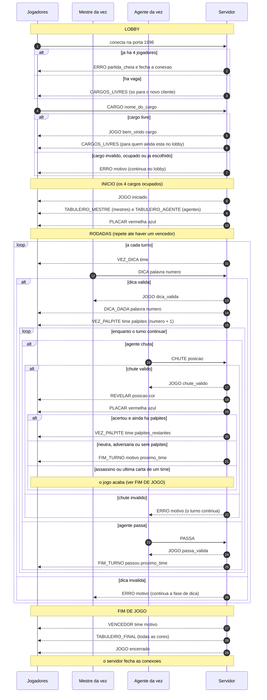

# Visão Geral
- Transporte: TCP pela confiabilidade do transporte, nada pode ser perdido e precisa ser recebido na ordem de sequência de envio
- Porta padrão: 1996, podendo ser trocada se estiver ocupada
- Jogadores: 4 por partida, dois times (azul e vermelha) com um agente e um mestre
- Codificação: UTF-8
- Quem inicia: O servidor fica parado escutando a porta 1996, e os clientes iniciam a conexão com ele
- Quem fala com quem: clientes conversam com o servidor, que verifica, valida e repassa informações para os outros jogadores
- Adendo: O servidor só aceita uma conexão por jogador, se uma partida estiver cheia (quinta conexão), o servidor rejeita a conexão e envia 'ERRO partida_cheia'

# Formato Mensagens
- Uma por linha, terminando com \n
- Estrutura: 'COMANDO arg1 arg2 ...'
- Comandos devem vir como maiúsculas, e argumentos separados com somente um espaço
- Palavras com espaço PRECISAM estar com '_' ao invés do espaço. Por exemplo 'SANCHO PANÇA' deve estar como 'SANCHO_PANÇA'
- Linhas vazias serão respondidas com 'ERRO linha_vazia' e comandos inválidos com 'ERRO comando_desconhecido'
- Erros serão respondidos com um motivo (uma palavra, em minúsculas, sem acento, com _ no lugar de espaços). A única exceção é 'cargo_ocupado', que leva também o cargo (em maiúsculas) como argumento. Eles não encerram a conexão com os jogadores e só vão para quem enviou os comandos errados

# Dicionário
- Cor da carta: 'VERMELHA', 'AZUL', 'NEUTRA', 'ASSASSINA' (o símbolo '?' só aparece no 'TABULEIRO_AGENTE', no lugar da cor de uma carta oculta)
- Time: 'VERMELHA', 'AZUL' (é o prefixo dos cargos)
- Cargo: 'VERMELHA_MESTREESPIAO', 'VERMELHA_AGENTE', 'AZUL_MESTREESPIAO', 'AZUL_AGENTE'
- Posição: inteiro de 1 a 25 (numeração descrita em Chutes)
- Palavra: texto em UTF-8, em maiúsculas, com '_' no lugar do espaço (ex.: 'JET_SKI', 'SANCHO_PANÇA'). A exceção é a dica enviada pelo mestre, que pode ter maiúsculas, minúsculas e acentos, mas não espaço nem '_' (ver Dica)
- Número da dica: inteiro de 1 a 9

# Cargos
- Deverão ser informados do cliente -> servidor durante o lobby antes de iniciar a partida
- Estrutura: 'CARGO <NOME_DO_CARGO>'
- Cargos disponíveis: 'VERMELHA_MESTREESPIAO', 'VERMELHA_AGENTE', 'AZUL_MESTREESPIAO', 'AZUL_AGENTE'
- Exemplos: 'CARGO VERMELHA_AGENTE', 'CARGO AZUL_MESTREESPIAO'
- Mensagem de sucesso recebida: 'JOGO bem_vindo <cargo>' 
- Erros: 
    - 'ERRO cargo_invalido' (provavelmente esqueceu o _, errou a escrita ou cargo não existe) 
    - 'ERRO fora_de_hora' (partida já iniciada ou já encerrada)
    - 'ERRO cargo_ocupado <cargo>' (cargo já escolhido)
    - 'ERRO cargo_ja_escolhido' (jogador já tem cargo e manda novamente)
    - 'ERRO argumentos_invalidos'

# Lobby
- Ao conectar, o servidor deve enviar 'CARGOS_LIVRES' só para o novo cliente
- 'CARGOS_LIVRES' também é enviada a todos que ainda estão no lobby (inclusive quem já escolheu cargo e espera os demais) sempre que um cargo é ocupado ou liberado
- Estrutura: 'CARGOS_LIVRES <cargo1> <cargo2> ...'
- Exemplo: 'CARGOS_LIVRES VERMELHA_MESTREESPIAO AZUL_AGENTE'
- Depois de 'ERRO cargo_ocupado' ou 'ERRO cargo_invalido' o jogador continua no lobby e pode mandar 'CARGO' de novo
- Se dois jogadores pedem o mesmo cargo ao mesmo tempo, o servidor atende o primeiro que processar, e o outro recebe 'ERRO cargo_ocupado <cargo>'
- Um jogador que já tem cargo e envia 'CARGO' de novo recebe 'ERRO cargo_ja_escolhido'
- Quando um jogador cai no lobby, o cargo dele é liberado e 'CARGOS_LIVRES' é reenviada
- Conexão rejeitada ('ERRO partida_cheia'): o servidor envia o erro e em seguida fecha a conexão

# Chutes
- Informado do cliente -> servidor, sendo o agente do time da rodada
- Estrutura: 'CHUTE <posicao>' (1 a 25, que é número de cartas no tabuleiro)
- Numeração: O tabuleiro tem 5 linhas tal como uma matriz com as linhas [1,2,3,4,5] , [6,7,8,9,10] , [11,12,13,14,15] , [16,17,18,19,20] , [21,22,23,24,25]. Cada um desses números é a posição dos chutes
- Exemplo: 'CHUTE 9'
- Mensagem de sucesso recebida: 'JOGO chute_valido'
- Erros: 
    - 'ERRO fora_de_vez' (caso mandado fora do turno ou enquanto é dada a dica)
    - 'ERRO fora_de_hora' (partida não iniciada ou já encerrada)
    - 'ERRO carta_ja_revelada'
    - 'ERRO posicao_invalida' (numero menor que 1 ou maior que 25)
    - 'ERRO papel_invalido'
    - 'ERRO argumentos_invalidos' (não seguiu o padrão de só um número int)

# Passa
- Informado de cliente -> servidor, por agentes e na fase de palpite. Pode ser depois de alguns chutes ou logo de cara no turno de palpites
- Serve para caso o agente não saiba o que chutar e não queira arriscar
- Estrutura: 'PASSA'
- Exemplo: 'PASSA'
- Mensagem de sucesso recebida: 'JOGO passa_valida'
- Erros: 
    - 'ERRO fora_de_vez' (caso mandado fora do turno ou enquanto é dada a dica)
    - 'ERRO fora_de_hora' (se a partida não foi iniciada ou já foi encerrada)
    - 'ERRO papel_invalido'
    - 'ERRO argumentos_invalidos'

# Revelar Carta
- Logo após o chute válido, servidor -> todos os jogadores (incluindo quem chutou) com a cor da carta do chute
- Estrutura: 'REVELAR <posicao> <cor>'
- Argumentos: <posicao> é de 1-25, e cor são de 4 tipos: 'VERMELHA', 'AZUL', 'NEUTRA', 'ASSASSINA'
- Exemplo: 'REVELAR 9 VERMELHA'

# Fases Jogo
- LOBBY: do início da conexão até todos os 4 cargos estarem ocupados
- DICA: o mestre do time da vez dá a dica
- PALPITE: o agente do time da vez chuta ou passa
- FIM: depois do 'JOGO encerrado'
- Mensagens aceitas (cliente -> servidor) em cada fase:
    - LOBBY: 'CARGO <NOME_DO_CARGO>'
    - DICA: 'DICA <palavra> <numero>'
    - PALPITE: 'CHUTE <posicao>', 'PASSA'
    - FIM: (nada)
- 'ERRO fora_de_hora': a mensagem não pertence à fase maior em que o jogo está (LOBBY, jogo em andamento ou FIM). Exemplos: 'CARGO' com a partida em andamento; 'CHUTE', 'PASSA' ou 'DICA' no LOBBY ou depois do FIM
- 'ERRO fora_de_vez': a fase maior está certa, mas a mensagem não é da subfase atual (DICA ou PALPITE) ou o jogador não é do time da vez. Exemplos: 'CHUTE' enquanto o mestre ainda dá a dica, 'DICA' enquanto os agentes chutam, 'CHUTE' do agente do outro time
- Quando mais de um erro se aplica à mesma mensagem, o servidor responde só o primeiro desta lista:
    1. 'linha_longa' e 'linha_vazia'
    2. 'comando_desconhecido'
    3. 'fora_de_hora'
    4. 'papel_invalido'
    5. 'fora_de_vez'
    6. 'argumentos_invalidos'
    7. erros específicos do comando ('cargo_invalido', 'cargo_ocupado', 'cargo_ja_escolhido', 'posicao_invalida', 'carta_ja_revelada', 'dica_invalida', 'numero_invalido')

# Dica
- Informado de cliente -> servidor, pelo mestre do time da vez e na fase de dica
- Estrutura: 'DICA <palavra> <numero>'
- Exemplo: 'DICA Itália 2'
- A palavra deve ser uma única palavra (só letras, acentos permitidos, sem '_').
- A palavra não pode ser igual a nenhuma carta ainda oculta do tabuleiro (cartas já reveladas não contam). O mestre pode enviar a palavra em maiúsculas ou minúsculas, com ou sem acento. A comparação com as cartas ignora maiúsculas, minúsculas e acentos (ex.: 'itália' é igual a 'ITALIA'), e o servidor repassa a dica em maiúsculas, mantendo os acentos (ex.: 'ITÁLIA')
- O número vai de 1 a 9. O número de palpites do turno é o número da dica + 1
- Resposta de sucesso: 'JOGO dica_valida' (só para o mestre), seguida de 'DICA_DADA' e 'VEZ_PALPITE' para todos
- Erros:
    - 'ERRO fora_de_hora' (partida não iniciada ou já encerrada)
    - 'ERRO fora_de_vez' (caso seja enviada enquanto os agentes estão chutando, ou seja do time adversário da vez)
    - 'ERRO papel_invalido' (quem enviou não é mestre)
    - 'ERRO argumentos_invalidos' (faltam ou sobram argumentos, ou o número não é inteiro)
    - 'ERRO dica_invalida' (palavra igual a uma carta oculta, ou com caracteres que não são letras)
    - 'ERRO numero_invalido' (número menor que 1 ou maior que 9)

# Tabuleiro
- É dado de servidor -> cada jogador, uma única vez, logo depois de 'JOGO iniciado'
- Estrutura: 'TABULEIRO_AGENTE <carta1> <carta2> ... <carta25>' e 'TABULEIRO_MESTRE <carta1> ... <carta25>'
- Cada carta é um único argumento: '<posicao>:<palavra>:<cor>:<revelada>'
    - Posicao: de 1 a 25
    - Palavra: com '_' no lugar de espaços
    - Cor: cor da carta; no 'TABULEIRO_AGENTE' vale '?' quando a carta ainda não foi revelada
    - Revelada: '0' (oculta) ou '1' (revelada)
- As 25 cartas vêm em ordem de posição (1 a 25)
- 'TABULEIRO_MESTRE' vai para os mestres; 'TABULEIRO_AGENTE' vai para os agentes
- Exemplo (abreviado): 'TABULEIRO_AGENTE 1:PIZZA:?:0 2:JET_SKI:?:0 ... 25:LUA:?:0'
- Regra de segurança: o servidor nunca envia a um agente a cor de uma carta oculta, em nenhuma mensagem
- Depois do envio inicial, o cliente mantém o tabuleiro e o atualiza a cada 'REVELAR'. O servidor não reenvia o tabuleiro durante a partida
- No fim da partida o servidor envia 'TABULEIRO_FINAL <carta1> ... <carta25>', no mesmo formato do mestre, para todos os jogadores. É a única exceção à regra de segurança, já que o jogo já acabou.

# Placar
- É feito de servidor -> todos, no começo do jogo (depois dos tabuleiros) e depois de cada 'REVELAR'
- Estrutura: 'PLACAR <vermelha_restantes> <azul_restantes>'
- Os valores são o número de cartas de cada time que ainda não foram reveladas, ou seja, está na frente quem está com o menor placar.
- Exemplo: 'PLACAR 6 7'

# Turnos
- Enviadas de servidor -> todos os jogadores. Cada cliente decide o que mostrar a partir do próprio cargo
- 'VEZ_DICA <time>': começa a fase de dica. Só o mestre desse time pode enviar 'DICA'. Exemplo: 'VEZ_DICA VERMELHA'
- 'DICA_DADA <palavra> <numero>': repassa a dica aceita para todos.
- 'VEZ_PALPITE <time> <palpites_restantes>': começa (ou continua) a fase de palpite. Só o agente desse time pode enviar 'CHUTE' ou 'PASSA'. Isso aqui acontece depois de 'DICA_DADA' com número + 1 palpites. Depois de cada acerto que não encerra o turno, é apenas descontado um palpite. Exemplo: 'VEZ_PALPITE VERMELHA 3'
- 'FIM_TURNO <motivo> <proximo_time>': encerra o turno. Sempre seguida de 'VEZ_DICA <proximo_time>'. Exemplo: 'FIM_TURNO errou AZUL'
    - motivo 'errou': a carta revelada era neutra ou do time adversário
    - motivo 'passou': o agente enviou 'PASSA'
    - motivo 'sem_palpites': o agente usou todos os palpites (a 'VEZ_PALPITE' nunca é enviada com 0 palpites restantes)
- Ordem de uma jogada: 'JOGO chute_valido' (só para quem chutou), 'REVELAR', 'PLACAR' e daí 'VEZ_PALPITE' (turno continua) ou 'FIM_TURNO' seguido de 'VEZ_DICA' (turno acabou) ou 'VENCEDOR' (jogo acabou)
- Para 'PASSA', a sequência é 'FIM_TURNO passou <proximo_time>' e 'VEZ_DICA <proximo_time>'

# Fim de jogo
- O jogo termina quando um time consegue todas as suas cartas ou quando um agente escolhe a carta assassina. Adendo: um time também pode, sem querer, pegar a última carta do seu adversário, fazendo o outro ganhar.
- Revelar a carta assassina faz perder o time de quem chutou
- Direção: servidor -> todos
- Estrutura: 'VENCEDOR <time> <motivo>'
    - motivo 'todas_cartas': todas as cartas do time vencedor foram reveladas (por qualquer jogador)
    - motivo 'assassino': o time adversário revelou a carta assassina
- Exemplo: 'VENCEDOR VERMELHA assassino'
- Sequência final: 'VENCEDOR', 'TABULEIRO_FINAL', 'JOGO encerrado'. Depois disso o servidor fecha as conexões

# Mensagens informativas
- Estrutura: 'INFO <texto>'
- Direção: servidor -> um ou todos os jogadores
- Exceção ao formato geral: é a única mensagem em que o texto pode ter espaços. Tudo depois de 'INFO ' é o texto
- O cliente só exibe o texto, e nenhuma ação depende dele
- Exemplo: 'INFO Aguardando jogadores (2/4)'

# Desconexão
- No lobby: o cargo é liberado e 'CARGOS_LIVRES' é reenviada
- Durante a partida: o servidor envia 'INFO <cargo> desconectou. Partida encerrada' aos jogadores restantes, depois 'JOGO encerrado' (sem vencedor), e fecha todas as conexões
- Cliente que perde a conexão com o servidor: mostra uma mensagem e encerra

# Jogo
- Quando todos os 4 jogadores já estiverem conectados e todos tiverem escolhido seus cargos, o servidor inicia o jogo enviando 'JOGO iniciado'
- Sequência de comandos:
    - Enviar CARGOS_LIVRES para todos os do lobby até todos terem escolhido
    - 'JOGO iniciado'
    - Para os Mestres: 'TABULEIRO_MESTRE <carta1> ... <carta25>'
    - Para os Agentes: 'TABULEIRO_AGENTE <carta1> ... <carta25>'
    - 'PLACAR <vermelha_restantes> <azul_restantes>'
    - Loop rodadas:
        - 'VEZ_DICA <time>'
            - Quando Mestre fornecer dica válida: 
                - 'JOGO dica_valida'
        - 'DICA_DADA <palavra> <numero>'
        - Enquanto o Turno continuar:
            - 'VEZ_PALPITE <time> <palpites_restantes>'
            - Quando Agente fornecer palpite válido: 
                - 'JOGO chute_valido'
                - 'REVELAR <posicao> <cor>'
                - 'PLACAR <vermelha_restantes> <azul_restantes>'
            - Se errar ou acabar os palpites:
                - 'FIM_TURNO <motivo> <proximo_time>'
            - Quando Agente passar:
                - 'JOGO passa_valida'
                - 'FIM_TURNO <motivo> <proximo_time>'
    - (quando um time vencer ou o outro perder):
        - 'VENCEDOR <time> <motivo>'
        - 'TABULEIRO_FINAL <carta1> ... <carta25>'
        - 'JOGO encerrado'

- Assim que algum time tenha conseguido todas as cartas certas ou algum deles tenha escolhido a carta assassina, o jogo é automaticamente encerrado com o servidor enviando 'VENCEDOR <time> <motivo>', 'TABULEIRO_FINAL' e 'JOGO encerrado'
- Respostas de Sucesso (enviadas só para quem mandou o comando, antes das demais mensagens da jogada):
    - CARGO: 'JOGO bem_vindo <cargo>'
    - CHUTE: 'JOGO chute_valido'
    - PASSA: 'JOGO passa_valida'
    - DICA: 'JOGO dica_valida'

# Limites e robustez
- Tamanho máximo de uma linha: 2048 caracteres (o tabuleiro tem cerca de 700). Acima disso, o servidor descarta a linha e responde 'ERRO linha_longa'
- O receptor aceita '\r\n' no fim da linha (remove o '\r')
- Comandos em minúsculas ou misturados são tratados como 'comando_desconhecido'
- Um comando que só o servidor envia (por exemplo 'REVELAR'), quando recebido pelo servidor, irá gerar 'ERRO comando_desconhecido'
- Cliente que recebe do servidor uma mensagem desconhecida ou malformada: ignora a linha e registra, sem encerrar

# Exemplo de uma rodada:

-- Lobby --
SERVIDOR>AGENTE_VERMELHA    CARGOS_LIVRES VERMELHA_MESTREESPIAO VERMELHA_AGENTE AZUL_MESTREESPIAO AZUL_AGENTE
AGENTE_VERMELHA>            CARGO VERMELHA_AGENTE
SERVIDOR>AGENTE_VERMELHA    JOGO bem_vindo VERMELHA_AGENTE
SERVIDOR>AGENTE_AZUL        CARGOS_LIVRES VERMELHA_MESTREESPIAO AZUL_MESTREESPIAO AZUL_AGENTE
AGENTE_AZUL>                CARGO VERMELHA_AGENTE
SERVIDOR>AGENTE_AZUL        ERRO cargo_ocupado VERMELHA_AGENTE
AGENTE_AZUL>                CARGO AZUL_AGENTE
SERVIDOR>AGENTE_AZUL        JOGO bem_vindo AZUL_AGENTE

(MESTRE_VERMELHA e MESTRE_AZUL entram do mesmo jeito, com JOGO bem_vindo para cada um)

-- Início --
SERVIDOR>*                  JOGO iniciado
SERVIDOR>MESTRE_VERMELHA    TABULEIRO_MESTRE 1:PIZZA:VERMELHA:0 2:JET_SKI:AZUL:0 ... 25:LUA:NEUTRA:0
SERVIDOR>MESTRE_AZUL        TABULEIRO_MESTRE 1:PIZZA:VERMELHA:0 2:JET_SKI:AZUL:0 ... 25:LUA:NEUTRA:0
SERVIDOR>AGENTE_VERMELHA    TABULEIRO_AGENTE 1:PIZZA:?:0 2:JET_SKI:?:0 ... 25:LUA:?:0
SERVIDOR>AGENTE_AZUL        TABULEIRO_AGENTE 1:PIZZA:?:0 2:JET_SKI:?:0 ... 25:LUA:?:0
SERVIDOR>*                  PLACAR 9 8
SERVIDOR>*                  VEZ_DICA VERMELHA

-- Turno vermelha --
MESTRE_VERMELHA>            DICA Itália 2
SERVIDOR>MESTRE_VERMELHA    JOGO dica_valida
SERVIDOR>*                  DICA_DADA ITÁLIA 2
SERVIDOR>*                  VEZ_PALPITE VERMELHA 3
AGENTE_AZUL>                CHUTE 5
SERVIDOR>AGENTE_AZUL        ERRO fora_de_vez
AGENTE_VERMELHA>            CHUTE 1
SERVIDOR>AGENTE_VERMELHA    JOGO chute_valido
SERVIDOR>*                  REVELAR 1 VERMELHA
SERVIDOR>*                  PLACAR 8 8
SERVIDOR>*                  VEZ_PALPITE VERMELHA 2
AGENTE_VERMELHA>            CHUTE 5
SERVIDOR>AGENTE_VERMELHA    JOGO chute_valido
SERVIDOR>*                  REVELAR 5 NEUTRA
SERVIDOR>*                  PLACAR 8 8
SERVIDOR>*                  FIM_TURNO errou AZUL
SERVIDOR>*                  VEZ_DICA AZUL

-- Turno azul (termina no assassino) --
MESTRE_AZUL>                DICA MAR 1
SERVIDOR>MESTRE_AZUL        JOGO dica_valida
SERVIDOR>*                  DICA_DADA MAR 1
SERVIDOR>*                  VEZ_PALPITE AZUL 2
AGENTE_AZUL>                CHUTE 12
SERVIDOR>AGENTE_AZUL        JOGO chute_valido
SERVIDOR>*                  REVELAR 12 ASSASSINA
SERVIDOR>*                  PLACAR 8 8
SERVIDOR>*                  VENCEDOR VERMELHA assassino
SERVIDOR>*                  TABULEIRO_FINAL 1:PIZZA:VERMELHA:1 2:JET_SKI:AZUL:0 ... 25:LUA:NEUTRA:0
SERVIDOR>*                  JOGO encerrado

# Fluxo //gerado pelo Claude com base em tudo que foi escrito acima
- Diagrama de sequência de uma partida, do lobby ao fim de jogo
- 'Jogadores' são os quatro clientes; 'Mestre da vez' e 'Agente da vez' são os jogadores do time que está jogando o turno
- Os nomes das mensagens seguem as seções acima. Os argumentos aparecem de forma abreviada

# Tabela de erros //gerado pelo Claude com base em tudo que foi escrito acima
- Todo 'ERRO' vai só para quem enviou a mensagem errada e não derruba a conexão. A exceção é 'partida_cheia', em que o servidor fecha a conexão logo depois
- Quando mais de um erro se aplica à mesma mensagem, vale a ordem de verificação descrita em Fases Jogo

| Motivo | Quando acontece | Mensagens |
|---|---|---|
| 'partida_cheia' | quinta conexão, com os 4 jogadores já conectados. O servidor fecha a conexão em seguida | conexão |
| 'linha_vazia' | linha sem conteúdo | qualquer |
| 'linha_longa' | linha acima do tamanho máximo. O servidor descarta a linha | qualquer |
| 'comando_desconhecido' | comando que não existe, escrito em minúsculas ou misturado, ou que só o servidor envia (ex.: 'REVELAR') | qualquer |
| 'argumentos_invalidos' | faltam ou sobram argumentos, ou o tipo está errado (ex.: 'CHUTE abc', porque não é inteiro) | 'CARGO', 'DICA', 'CHUTE', 'PASSA' |
| 'cargo_invalido' | o nome não é um dos 4 cargos (esqueceu o '_', errou a escrita ou o cargo não existe) | 'CARGO' |
| 'cargo_ocupado <cargo>' | o cargo já foi escolhido por outro jogador. É o único erro com argumento | 'CARGO' |
| 'cargo_ja_escolhido' | o jogador já tem cargo e enviou 'CARGO' de novo | 'CARGO' |
| 'fora_de_hora' | a mensagem não pertence à fase maior do jogo (LOBBY, jogo em andamento ou FIM). Ex.: 'CARGO' com a partida em andamento, 'CHUTE' no lobby | 'CARGO', 'DICA', 'CHUTE', 'PASSA' |
| 'fora_de_vez' | a fase maior está certa, mas a mensagem não é da subfase atual (DICA ou PALPITE) ou o jogador não é do time da vez | 'DICA', 'CHUTE', 'PASSA' |
| 'papel_invalido' | quem enviou não tem o papel: mestre mandando 'CHUTE' ou 'PASSA', ou agente mandando 'DICA' | 'DICA', 'CHUTE', 'PASSA' |
| 'posicao_invalida' | a posição é um inteiro, mas menor que 1 ou maior que 25 (ex.: 'CHUTE 99') | 'CHUTE' |
| 'carta_ja_revelada' | a carta escolhida já foi revelada | 'CHUTE' |
| 'dica_invalida' | a palavra é igual a uma carta ainda oculta do tabuleiro, ou tem caracteres que não são letras | 'DICA' |
| 'numero_invalido' | o número da dica é inteiro, mas menor que 1 ou maior que 9 | 'DICA' |